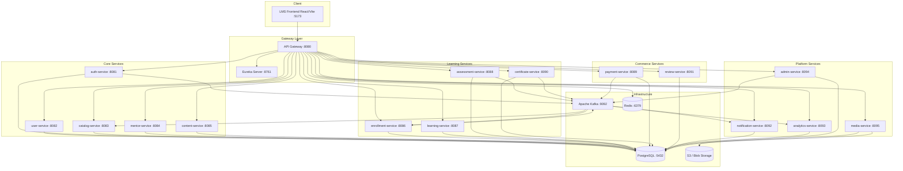

# LMS Backend Architecture

## System Diagram



## Service Communication Patterns

### Synchronous (REST via Eureka)
- Gateway → Any service (HTTP routing)
- content-service → media-service (file upload)
- payment-service → catalog-service (price fetch)
- admin-service → content-service (approval queue)

### Asynchronous (Kafka Events)
- auth-service → notification-service (`user.registered`)
- payment-service → enrollment-service (`payment.success`)
- enrollment-service → certificate-service (`track.completed`)
- admin-service → catalog-service (`course.approved`)

## Database Strategy

**Database-per-service** pattern:
- Har service ka apna PostgreSQL database
- Cross-service data access sirf API ya Kafka se
- Shared PostgreSQL instance, separate schemas/databases

## Security

1. JWT issued by auth-service
2. API Gateway validates token on every request
3. Role-based access at gateway level
4. Service-to-service: internal network only
5. Secrets via environment variables / Vault

## Deployment Order

```
1. PostgreSQL, Redis, Kafka, Zookeeper
2. eureka-server
3. api-gateway
4. auth-service, user-service (core)
5. catalog-service, mentor-service, content-service
6. enrollment, learning, assessment, payment
7. certificate, review, notification, analytics, admin, media
```

## Total API Summary

| Service | APIs |
|---------|------|
| auth-service | 12 |
| user-service | 14 |
| catalog-service | 16 |
| mentor-service | 10 |
| content-service | 18 |
| enrollment-service | 10 |
| learning-service | 12 |
| assessment-service | 16 |
| payment-service | 14 |
| certificate-service | 6 |
| review-service | 8 |
| notification-service | 8 |
| analytics-service | 10 |
| admin-service | 12 |
| media-service | 8 |
| **TOTAL** | **164** |

> Gateway + Eureka have 2 infrastructure endpoints each (health/actuator)
